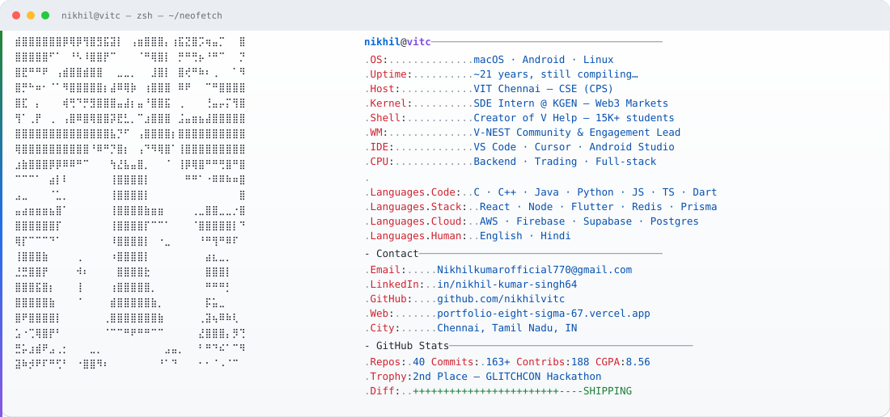

<!--
  nikhil@vitc — terminal profile
  Inspired by neofetch / sysinfo aesthetic
-->

<a href="https://github.com/nikhilvitc">
  <picture>
    <source media="(prefers-color-scheme: dark)" srcset="./dark_mode.svg"/>
    
  </picture>
</a>

---

<details>
<summary><strong>⌘ click to expand — projects &amp; stack</strong></summary>

<br/>

```bash
$ cat ~/projects.list
```

| project | stack | what it does |
|:--------|:------|:-------------|
| **KGEN backend** | Node · TS · Postgres · Redis · Prisma | Live Web3 prediction-market services |
| **V Help** | Full-stack | Campus platform · **15K+** students |
| **PII Masking** | Python · OCR | Auto-detect & redact personal data |
| **VitaData** | TypeScript | Healthcare platform · RBAC |
| **Chat + Meetings** | React · AWS | Realtime chat · instant meetings |
| **KrishiDeep** | Flutter · ML | SIH crop advisor · disease detection |
| **Trading Engine** | Node · Express | Order matching · live dashboard |

<br/>

```bash
$ neofetch --skills
```

<p align="center">
  
</p>

</details>

---

<div align="center">

```text
┌──────────────────────────────────────────────────────────┐
│  open to internships · collabs · weird product ideas     │
│  mail → Nikhilkumarofficial770@gmail.com                 │
│  web  → portfolio-eight-sigma-67.vercel.app              │
│  in   → linkedin.com/in/nikhil-kumar-singh64             │
└──────────────────────────────────────────────────────────┘
```

<p>
  <a href="mailto:Nikhilkumarofficial770@gmail.com"></a>
  <a href="https://www.linkedin.com/in/nikhil-kumar-singh64/"></a>
  <a href="https://portfolio-eight-sigma-67.vercel.app"></a>
  <a href="https://leetcode.com/u/nikhilros/"></a>
  
</p>


<br/>


<br/><br/>

<sub><code>exit 0</code> · built for dark mode · ships daily</sub>

</div>
